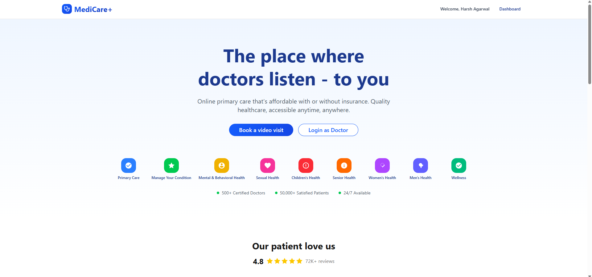

# MediCare+ 🏥👩‍⚕️


[](https://medicare-ljh4.onrender.com)
[](https://nextjs.org/)
[](https://expressjs.com/)
[](https://www.mongodb.com/)
[](https://www.zegocloud.com/)

MediCare+ is a comprehensive **Online Doctor Consultation Platform** that seamlessly connects patients with specialized healthcare professionals. Built with a modern full-stack architecture, it offers secure authentication, appointment scheduling, integrated payment processing, and high-quality 1-on-1 video consultations.

---

## ✨ Features

### 🧑‍💼 For Patients
* **Secure Onboarding:** Email/Password and Google OAuth login options.
* **Specialist Discovery:** Browse and filter doctors by specialization.
* **Real-time Availability:** View doctors' schedules and book available time slots dynamically.
* **Integrated Payments:** Secure and smooth checkout using Razorpay for consultation fees.
* **Virtual Consultations:** High-quality, browser-based video & voice calls via ZegoCloud.
* **Dashboard:** Manage upcoming and past appointments effortlessly.

### 👨‍⚕️ For Doctors
* **Profile Management:** Set up specializations, experience, fees, and hospital details.
* **Flexible Scheduling:** Customize weekly availability and consultation time slots.
* **Appointment Handling:** Approve, manage, and track patient consultations.
* **Consultation Workspace:** Integrated video/audio calling interface with patients.
* **Earnings Dashboard:** Track completed appointments and consultation revenue.

---

## 🛠️ Tech Stack

### Frontend (Client-side)
* **Framework:** [Next.js 15](https://nextjs.org/) (App Directory structure)
* **Styling:** [Tailwind CSS](https://tailwindcss.com/) & [Radix UI](https://www.radix-ui.com/) (Accessible components)
* **State Management:** [Zustand](https://zustand-demo.pmnd.rs/) (Fast, scalable store)
* **Video/Audio Calling:** [@zegocloud/zego-uikit-prebuilt](https://www.zegocloud.com/)
* **Animations:** [Framer Motion](https://www.framer.com/motion/)
* **Date Handling:** `date-fns` & `react-day-picker`

### Backend (Server-side)
* **Runtime:** Node.js
* **Framework:** [Express.js](https://expressjs.com/)
* **Database:** [MongoDB](https://www.mongodb.com/) (Mongoose ORM)
* **Authentication:** [Passport.js](https://www.passportjs.org/) (Google OAuth) & JWT (JSON Web Tokens)
* **Payment Gateway:** [Razorpay API](https://razorpay.com/)
* **Security:** `helmet`, `cors`, `bcryptjs`

---

## 🚀 Getting Started (Local Development)

### Prerequisites
Make sure you have the following installed:
* Node.js (v18 or newer)
* npm or yarn
* A MongoDB cluster (Atlas or local)

### 1. Clone the repository
```bash
git clone https://github.com/YOUR_USERNAME/MediCare.git
cd MediCare
```

### 2. Install Dependencies
We use a root script to install dependencies for both the frontend and backend simultaneously:
```bash
npm run install:all
```

### 3. Environment Variables
You need to set up `.env` files in both the `frontend` and `backend` directories.

**`backend/.env`**
```env
PORT=8000
NODE_ENV=development
MONGO_URI=your_mongodb_connection_string
JWT_SECRET=your_super_secret_jwt_key
FRONTEND_URL=http://localhost:3000

# Google OAuth
GOOGLE_CLIENT_ID=your_google_client_id
GOOGLE_CLIENT_SECRET=your_google_client_secret
GOOGLE_CALLBACK_URL=http://localhost:8000/api/auth/google/callback

# Razorpay
RAZORPAY_KEY_ID=your_razorpay_test_key_id
RAZORPAY_KEY_SECRET=your_razorpay_test_key_secret

# Cloudinary (Profile Pictures)
CLOUDINARY_CLOUD_NAME=your_cloud_name
CLOUDINARY_API_KEY=your_api_key
CLOUDINARY_API_SECRET=your_api_secret

ALLOWED_ORIGINS=http://localhost:3000,http://127.0.0.1:3000
```

**`frontend/.env.local`**
```env
NEXT_PUBLIC_API_URL=http://localhost:8000/api
NEXT_PUBLIC_ZEGOCLOUD_APP_ID=your_zegocloud_app_id
NEXT_PUBLIC_ZEGOCLOUD_SERVER_SECRET=your_zegocloud_secret
```

### 4. Start the Application (Development)
Open two terminal instances.

**Terminal 1 (Backend):**
```bash
npm run dev:backend
```

**Terminal 2 (Frontend):**
```bash
npm run dev:frontend
```

The app will be available at `http://localhost:3000`.

---

## ☁️ Deployment (Render)

This project is configured as an **Integrated Monorepo** for deployment on Render. A single Web Service handles building the Next.js frontend and serving it through the Express.js backend using the Next.js `standalone` output.

1. Create a new **Web Service** on Render connected to your GitHub repo.
2. Use the following build settings:
   * **Build Command:** `npm run install:all && npm run build`
   * **Start Command:** `npm start`
3. Add all the Environment Variables listed above into the Render dashboard.
   * *Critical Updates for Production Env Vars:*
     * `NODE_ENV=production`
     * `NEXT_PUBLIC_API_URL=https://your-app.onrender.com/api`
     * `FRONTEND_URL=https://your-app.onrender.com`
     * `ALLOWED_ORIGINS=https://your-app.onrender.com`
     * `GOOGLE_CALLBACK_URL=https://your-app.onrender.com/api/auth/google/callback`
     * `RENDER_EXTERNAL_URL=https://your-app.onrender.com`

**Keep-Alive Ping:** The backend automatically pings itself every 14 minutes to prevent Render's free tier from spinning down!

---

## 📁 Project Structure

```
MediCare/
├── backend/                  # Express.js Server
│   ├── config/               # Passport, DB configurations
│   ├── controllers/          # Route logic
│   ├── middleware/           # Auth, Error handlers
│   ├── models/               # Mongoose schemas (Doctor, Patient, Appointment)
│   ├── routes/               # Express API routes
│   └── server.js             # Entry point & production proxy setup
│
├── frontend/                 # Next.js Application
│   ├── src/
│   │   ├── app/              # Next.js App Router pages
│   │   ├── components/       # Reusable UI components & ZegoCloud Call View
│   │   ├── store/            # Zustand state management
│   │   └── lib/              # Utility functions
│   ├── public/               # Static assets
│   └── next.config.ts        # Next.js standalone build config
│
├── package.json              # Root scripts (install:all, build, start)
└── render.yaml               # Deployment configuration blueprint
```

---

## 🤝 Contributing
Contributions, issues, and feature requests are welcome! Feel free to check the [issues page](https://github.com/YOUR_USERNAME/MediCare/issues).

---

## 📝 License
This project is [MIT](https://choosealicense.com/licenses/mit/) licensed.
